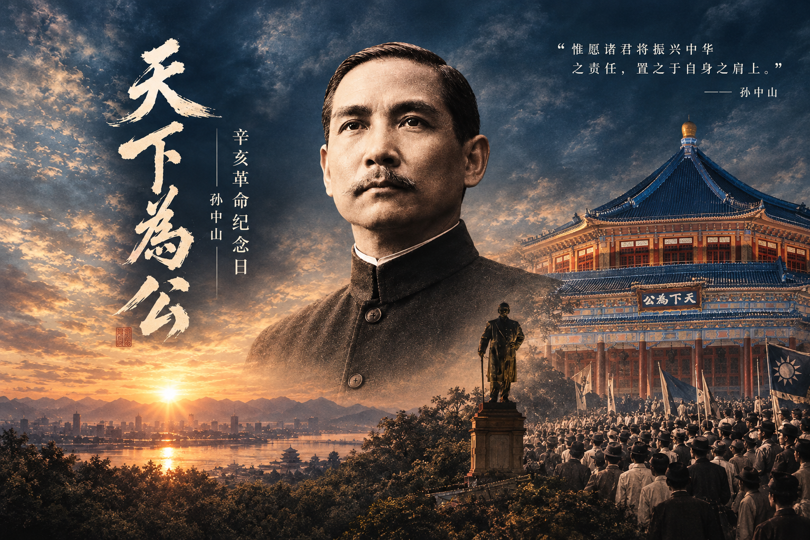

有些历史，随着岁月流逝，并不会变得遥远；有些理想，即使历经百年，依然值得我们重新思考。

每当看到“天下为公”四个字，总会让人想到孙中山先生。它不仅是一句流传至今的箴言，更承载着一代先行者对国家、民族与普通民众命运的深切关怀。

辛亥革命已经过去百余年。今天，当我们重新回望那段风云激荡的岁月，回望孙中山先生走过的道路，看到的不只是一个时代的变迁，还有一种在困境中不肯放弃的理想。

## 时代的风雨，唤醒变革的渴望

十九世纪末至二十世纪初的中国，正处于内忧外患之中。民族危机日益深重，旧有的政治秩序难以回应时代的挑战。越来越多的有识之士开始思考：中国应当走向何方？中华民族又该如何实现独立、富强与新生？

孙中山先生正是在这样的时代背景下，走上了探索救国道路的历程。

从早年的革命活动，到兴中会的创立，再到后来组织同盟会、推动革命事业，他始终希望通过变革，改变国家积贫积弱的局面。

1911年，武昌起义爆发，各地相继响应，辛亥革命由此推动了清王朝的覆灭。1912年，中华民国成立，中国延续两千余年的君主专制政体走向终结。

这场革命并没有立刻解决中国面临的所有问题，国家统一、社会稳定与民族复兴的道路依然曲折。但它打开了一扇新的大门，让民主共和的理念更加广泛地进入中国人的政治生活，也让更多人开始重新认识国家、社会与个人之间的关系。

历史的意义，有时不在于一场变革完成了多少目标，更在于它为后来者留下了怎样的道路与启示。

## “天下为公”，是一种怎样的理想？

“天下为公”出自《礼记·礼运》，孙中山先生将其作为重要的政治理想之一。

在他的思想中，国家不应只是少数人的私产，公共权力应当服务于人民，社会的发展也应当以民众的福祉为重要目标。

他提出民族、民权、民生三民主义，希望从民族独立、政治建设和民生改善等方面，探索中国的出路。

民族主义，关乎国家的独立与民族的尊严；民权主义，关乎人民的权利与国家的政治制度；民生主义，则关乎百姓的生活与社会的公平。

这三个方面并非彼此孤立。一个国家的发展，不仅需要外在的独立，也需要合理的制度安排，更离不开普通人的生活能够不断改善。

因此，“天下为公”并不只是一句适合写在墙上的话。

它也可以是一种朴素的追问：公共事务究竟为了谁？发展的成果应当由谁共享？一个社会在追求进步的同时，能否让更多普通人拥有尊严、机会与希望？

这些问题并没有随着历史翻页而失去意义。

## 理想的道路，从来不是一帆风顺

回顾孙中山先生的一生，很难忽略其中的艰难与曲折。

革命事业曾屡遭挫折，政治局势也多次发生变化。辛亥革命推翻了清王朝，却未能立即建立起稳定、统一的新国家。此后的中国仍经历了长期的动荡与探索。

这提醒我们，历史上的伟大转折，往往只是新征程的开始。

推翻旧秩序，需要勇气；建设新秩序，需要耐心与智慧。提出理想，需要坚定的信念；让理想逐步成为现实，则需要一代又一代人的持续努力。

孙中山先生曾为革命事业奔走呼号，也曾面对现实与理想之间的巨大落差。他的经历让人看到，真正值得铭记的，不只是一个人站在历史舞台中央的时刻，还有他在困难面前仍然选择继续前行的决心。

纪念历史人物，并不意味着将其经历简单地理想化。真正的纪念，应当是在理解时代局限与历史复杂性的基础上，认识他们为什么出发、做过什么，以及他们留下了哪些值得继续讨论的问题。

历史不需要被神化，历史更需要被理解。

## 从历史走向今天

今天的我们，已经生活在与辛亥革命时期截然不同的时代。

我们不必亲历当年的战火与动荡，却仍然可以从那段历史中获得一些启发。

首先，是对国家与民族命运的关切。个人的生活与时代的发展从来不是完全割裂的。社会环境的变化，会影响每一个普通人的机会、选择与未来。

其次，是对公共责任的理解。一个社会的进步，不只体现在宏大的数字与壮观的建设之中，也体现在人们能否获得公平的机会，能否被认真倾听，能否在日常生活中感受到尊重与善意。

最后，是对理想与现实关系的思考。理想并不会因为被提出就自动实现。它需要行动，需要制度与社会的共同努力，也需要不断面对现实、修正方法、积累成果。

对于普通人而言，承担责任未必意味着做出惊天动地的事业。认真对待自己的工作，尊重他人的权利，关心身边的人，在力所能及的范围内为公共生活贡献一点力量，同样是把价值观落实到现实之中的方式。

历史人物的意义，也许就在于让我们在回望过去时，更清楚地思考今天应当怎样生活。

## 纪念，是为了更好地理解未来

夜色中的纪念建筑，在灯光映照下显得庄严而深沉。抬头望去，飞檐、斗拱与层层铺展的屋顶，仿佛将不同年代连接在一起；而那句“天下为公”，仍然安静地停留在视线之中。

建筑会经历修缮，城市会不断改变，时代也会继续向前。真正能够穿越时间的，不只是留存下来的砖瓦与影像，还有人们对自由、平等、尊严与美好生活的追求。

辛亥革命是中国近代历史上的重要转折，孙中山先生则是这段历史中具有重要影响的人物。他所处的时代有其特殊的困境，他所探索的道路也有其复杂的历史条件。但他对于民族独立、国家建设与民生改善的关注，仍然值得后人认真回顾。

纪念，不应只停留在某个日期，也不应只是对往昔的感叹。

它更意味着，在面对今天的生活时，我们依然愿意思考：怎样才能让社会变得更好？怎样才能让个人的努力与公共利益形成更积极的联系？又该如何在纷繁复杂的现实中，保有对未来的信心与责任感？

百余年风云已过，历史仍在回响。

愿我们记得那些在时代转折中探索道路的人，也记得每一份理想都需要现实中的努力来承接。

**天下为公。它属于历史，也是一道留给今天的思考题。**
